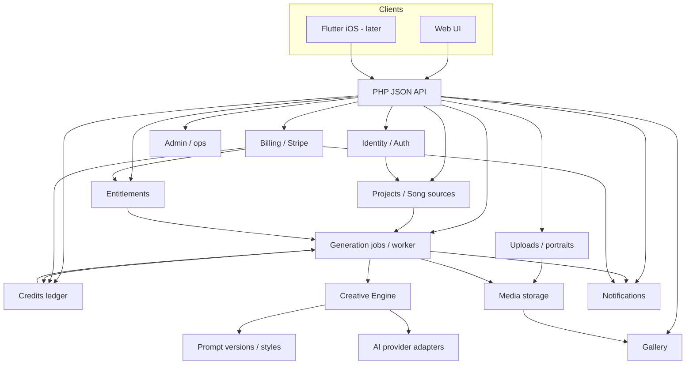

# 16 — V2 Build Map Summary

**Purpose:** short, readable answer to “What are all the major pieces we need to build?”  
**Status:** implementation guidance for authorized Private Development Build 1.
**Detail:** `15-v2-systems-inventory.md`  
**Date:** 2026-08-27

> **Superseding decision notice, 2026-08-28:** identity, invitations, sessions, API transport, privacy, deletion, sharing, abuse protection, owner audit and initial local-storage behavior are now owner-approved in `development-vault/05 Product Design/Implementation Readiness Contract.md` and `development-vault/07 Development/Shared API, Security and Data Contract.md`. Older open-decision labels below are historical and do not override those contracts.

> **Deployment decision notice, 2026-08-28:** Hostinger Premium Web Hosting, SQLite, a one-minute Cron Jobs worker, controlled `main` releases, Hostinger SMTP, local-media staging and the approved beta cost limits are defined in `development-vault/07 Development/Deployment and Operating Cost Contract.md`. VPS is the larger-deployment path.

---

## One-line skeleton

Accounts and projects feed a staged creative engine that runs as background jobs, talks to swappable AI providers, stores owned media, and is gated by entitlements/credits/billing — all behind a PHP JSON API serving the web app now and Flutter later.

---

## Accepted direction (do not rediscuss here)

- Rebuild **functionality**, not V1 code  
- **PHP** + **SQLite** initially  
- **Web first** → **Flutter/Dart iOS** second on the same APIs  
- Staged creative engine (contracts still open)  
- **Private scaffolding and implementation authorized**; external and commercial launch remain gated

---

## Major systems at a glance

| System | What it does | MVP status | Major dependencies | Key open decisions |
|---|---|---|---|---|
| **Identity** | Register, login, sessions/tokens, reset, verify, profile, roles, deletion | **Required** | Email, security | Invite-only? V1 credential migrate? Token strategy for mobile |
| **Content / Projects** | User-owned song projects, source snapshots, job history, variations | **Required** (projects can start thin) | Identity | Project vs flat job list UX |
| **Creative Engine** | Source → interpretation → DNA → narrative → identity → portraits → scene → compile → eval → retry | **Required** (core stages) | AI, prompts, jobs | Lore vs visual identity; user-edit DNA; portrait drop policy |
| **AI Providers** | Text + image adapters, errors, retries, cost metadata | **Required** | Config/secrets | Which vendors for MVP (not locked to Gemini) |
| **Prompt System** | Versioned specs, curated styles, compile, provenance, experiments | **Required** | Creative engine, admin | Style library recovery; revision workflow |
| **Uploads** | Portrait/reference upload, validation, ownership | **Open** (Required if portraits ship) | Storage, entitlements | Retention; 1–2 vs ensembles |
| **Media Storage** | Store originals/thumbnails; abstract local + object storage | **Required** | Jobs, gallery | Keep B2 or choose other; private vs public URLs |
| **Job Queue** | Submit, claim, status, attempts, timeout, cancel | **Required** | SQLite, worker process | Concurrency limits; progress granularity |
| **Gallery** | History, detail, delete, download, optional share/favorites | **Required** | Media, projects | Sharing/privacy defaults |
| **Credits** | Ledger, reserve, capture, refund, history | **Open** (Required if credits kept) | Jobs, billing | Credits vs sub-only vs hybrid |
| **Billing** | Stripe checkout, webhooks, packs/subs, fulfillment | **Useful** for paid launch | Ledger, entitlements | Product catalog; iOS store boundary later |
| **Entitlements** | Feature gates separate from plan marketing names | **Required** thin | Billing, identity | Which gates (portraits, styles, aspect, priority…) |
| **Notifications** | Email + future push behind one interface | **Useful** (auth email with reset/verify) | Account, jobs | Push provider later |
| **Admin** | User/credit/job/style inspection; maintenance | **Useful** thin | All core systems | How much UI vs scripts |
| **API** | HTTP/JSON capability boundaries for web + Flutter | **Required** | All domain modules | Exact resource shapes |
| **Web UI** | Landing, auth, generator, progress, result, gallery, account, billing | **Required** | API | Visual brand; marketing depth |
| **Mobile Client** | Flutter iOS consuming same backend | **Later** | Stable API, token auth, uploads | App Store purchases research |
| **Security** | CSRF, authz, private media, secrets, rate limits, redaction | **Required** | Every surface | Deletion/privacy policy text |
| **Operations** | Host PHP, worker, SQLite backups, env, logs, migrations | **Required** at launch | Storage, email, Stripe, AI | Hosting choice |
| **Testing** | Authz, ledger, webhooks, jobs, prompt schemas, adapters | **Required** with first code | Domain design | Fixture strategy |

---

## Dependency map



Conceptual flow (non-Mermaid):

```text
Users/Auth
   ↓
Projects / Song sources
   ↓
Creative Engine → AI Providers
   ↓                 ↗
Generation Jobs ← Credits / Entitlements
   ↓                    ↑
Media Storage ←—— Billing
   ↓
Gallery

API → Web + Flutter
```

---

## What V1 proved vs what V2 decided vs recommendations

| Topic | V1 proved | V2 decided | Recommendation |
|---|---|---|---|
| Async generation | Queue + worker + poll | Keep async | One canonical pipeline |
| Song DNA | 12-field staged interpretation | Keep staged idea | Explicit versioned artifact; split meaning vs cinematography |
| Dynamic “lore” | StyleMap visual identity, not lore bible; UI default skipped it | Name/behavior open | Separate visual identity from lore; decide default on/off |
| Portraits | Inline refs; silent drop on late retries | Priority: protect identity | Never silent drop |
| Credits | Check-then-debit race | Not decided | Ledger + reservation if credits remain |
| Payments | Stripe packs/subs; dual webhooks | Not decided | One webhook; idempotent fulfillment |
| Storage | Local + B2 | Adapter direction | Abstract; B2 optional |
| Stack | PHP/MySQL/Gemini hardwired | PHP + SQLite; Flutter later; adapters | Do not copy V1 layout or MySQL requirement |
| Mobile | Redirect hack | Flutter iOS second | JSON APIs from day one |

---

## Phased implementation recommendation

**Build the private version in this order:**

### Phase A — Foundation

- App skeleton (PHP), config, migrations, SQLite, auth (register/login/session), CSRF, env examples  
- Minimal user + entitlement stub  
- Storage adapter interface (local)  
- JSON API conventions + health  
- Test harness  

*Unblocks everything else.*

### Phase B — First generation vertical slice

- Project/source + create generation job  
- Worker claim loop (SQLite-safe)  
- Minimal creative path: source → Song DNA → compile → one image provider → store asset  
- Progress polling + result page  
- Prompt version recording  

*Proves the product promise end-to-end without billing complexity.*

### Phase C — Gallery and accounting

- Gallery list/detail/delete/download  
- Credit ledger + reservation/capture/refund **if** credits chosen  
- Entitlement checks server-side  
- Richer job attempts / failure reasons  
- Optional portraits if product decision says yes  

### Phase D — Billing and thin admin

- Stripe checkout + single webhook + idempotency  
- Plans → entitlements mapping  
- User lookup, credit adjust, job inspect, style activate  
- Maintenance mode  

### Phase E — Production hardening

- Object storage production adapter  
- Backups, logging redaction, rate limits  
- Email reliability  
- Retry policy with honest portrait labeling  
- Full prompt/style versioning UX  
- Security review of media authz  

### Phase F — Flutter / iOS client

- Token auth against existing API  
- Generator, poll, gallery, account  
- Upload + share  
- Separate store purchase integration research/implementation  

Creative-engine refinements (narrative plan, artist identity default, user-editable DNA) can land inside B–E as owner decisions land — they should not wait for Flutter.

---

## MVP-critical systems (cannot fake forever)

1. Identity / auth  
2. Generation jobs + worker  
3. Creative engine core (DNA → compile → image)  
4. AI provider adapters  
5. Prompt versioning (at least hashes)  
6. Media storage + ownership  
7. Gallery  
8. Entitlements (even if everyone is “same plan”)  
9. PHP JSON API + web generator/result UI  
10. Security baseline + migrations/backups when coding starts  

Credits and Stripe are **commercially** critical for a paid launch but can follow the vertical slice. Portraits and Flutter are **product-sequence** decisions, not day-zero blockers for a non-portrait web slice.

---

## Retire / do not port

- Multiple queue workers and Stripe webhooks  
- Mutable credits as sole ledger  
- Hardwired Gemini model IDs in domain code  
- Invite-only **unless** re-chosen  
- Mobile redirect landing  
- Mega-prompt contradictions and silent identity loss  
- V1 PHP file layout as architecture  

---

## Read next

- Full inventory: `15-v2-systems-inventory.md`  
- Decision Inbox / `12-open-creative-decisions.md` before freeze lift  
- Prompt refs: `13`, `14`  
- Vault: Current Priorities, Creative Engine, accepted ADRs  
